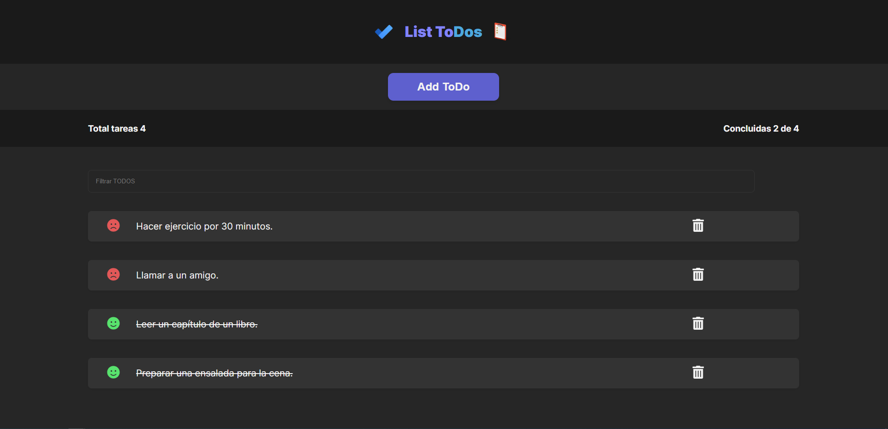
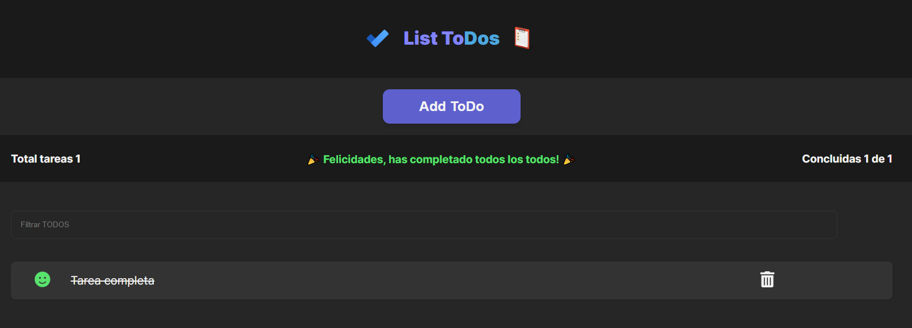

# React TODO MACHINE

Welcome to the React TODO MACHINE project! 🚀 This task management app was crafted with love during the immersive React introduction course on Platzi. It's not your average TODO app; it's a dynamic powerhouse that lets you add, delete, mark tasks as completed, and more!

## Quick Links

- **Project Demo:** [TODO MACHINE](https://nicolascastro77.github.io/curso-react-intro/)
- **Platzi Course:** [Introduction to React](https://platzi.com/cursos/react/)

## Sneak Peek

Dive into the visual awesomeness with these screenshots:

## Features Galore

- Seamlessly toggle between completed and pending tasks.
- Add new tasks on the fly to stay organized.
- Bid farewell to unwanted tasks with the delete functionality.
- Watch the counters dance as you complete and add tasks.
- Experience slick modals courtesy of `react.portal`.
- Stay informed with alerts for zero tasks and all tasks completed.

## Installation Magic

1. Clone this repository: `git clone https://github.com/nicolascastro77/curso-react-intro.git`
2. Install dependencies: `npm install`
3. Launch the app: `npm start`
